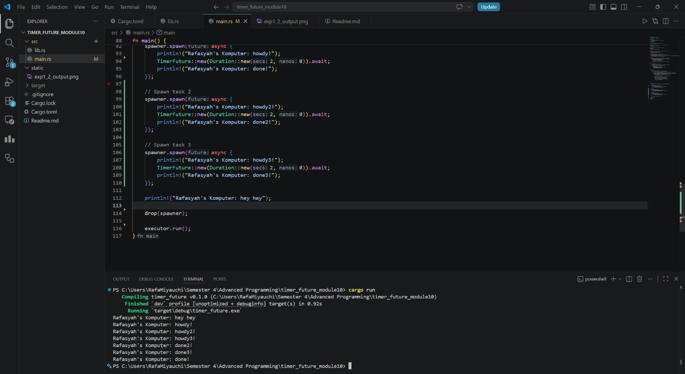
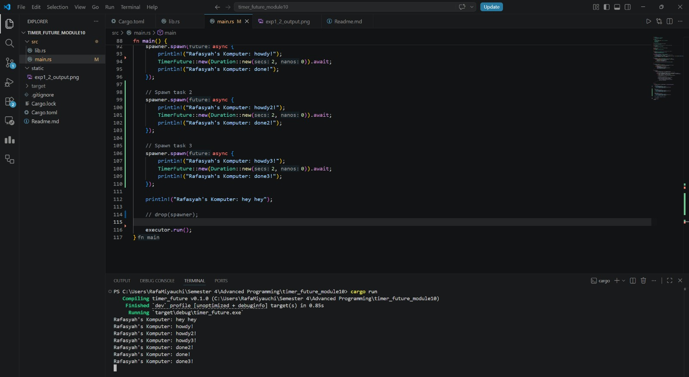

# Module 10 - Asynchronous Programming

## Experiment 1.2: Understanding how it works

**Explanation:**
When we run the code, `Rafasyah's Komputer: hey hey` prints **before** `howdy!` and `done!`. 

I think this happens because `spawner.spawn` only builds the future and queues it up in the channel to be executed later. it does not actually run the task immediately. There the main thread continues executing the code synchronously, calling the `println!("... hey hey")` statement first. From what I know the queued asynchronous task only actually begins executing when we call `executor.run()` at the very end of the `main` function, which is when `howdy!` is finally printed. 

As for the `drop(spawner)` line, it closes the sending half of the channel so that `executor.run()` knows no more tasks are coming and can safely exit once the queue is empty.

## Experiment 1.3: Multiple Spawn and removing drop

### With `drop(spawner)`

### Without `drop(spawner)` (Program Hangs)

**Explanation & Correlation:**
* **What is the effect of spawning?** I think the effect of Spawning multiple tasks is that it queues them up in the channel simultaneously. Because they are asynchronous, the executor can poll them concurrently. They all wait for their timers at the same time, rather than waiting for one to finish before starting the next.
* **What is the spawner for?** From what I know the spawner acts as a transmitter. Its job is to take an async task (a future), wrap it, and send it into the task channel queue.
* **What is the executor for?** The executor acts as the receiver and runner. It continuously pulls tasks out of the channel queue and calls `poll` on them to drive them toward completion.
* **What is the drop for?** I think dropping the spawner closes the sending half of the channel. this happens because the executor finishes processing all tasks in the queue, it tries to receive more. If the channel is closed for example, because the spawner was dropped, `recv()` would returns an error, which then breaks the loop which also allows the program to exit gracefully. If we instead remove `drop(spawner)`, the executor's `recv()` loop blocks forever waiting for tasks that will never come, causing the program to hang.