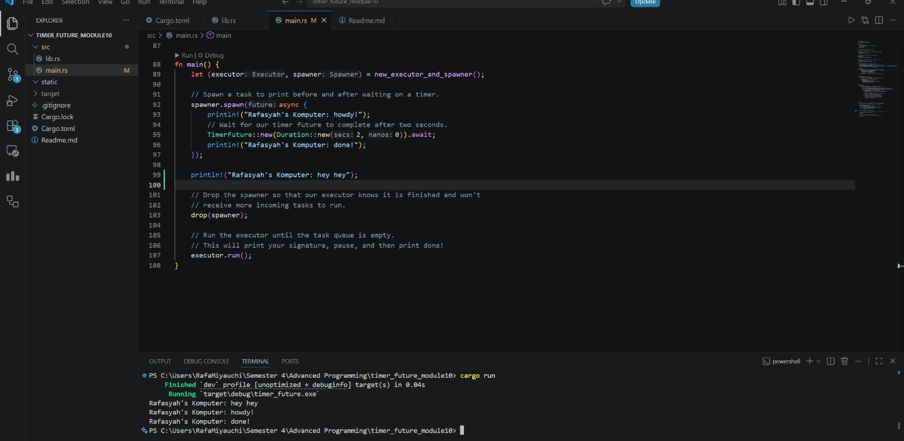

# Module 10 - Asynchronous Programming

## Experiment 1.2: Understanding how it works

**Explanation:**
When we run the code, `Rafasyah's Komputer: hey hey` prints **before** `howdy!` and `done!`. 

I think this happens because `spawner.spawn` only builds the future and queues it up in the channel to be executed later. it does not actually run the task immediately. There the main thread continues executing the code synchronously, calling the `println!("... hey hey")` statement first. From what I know the queued asynchronous task only actually begins executing when we call `executor.run()` at the very end of the `main` function, which is when `howdy!` is finally printed. 

As for the `drop(spawner)` line, it closes the sending half of the channel so that `executor.run()` knows no more tasks are coming and can safely exit once the queue is empty.